<div align="center">


</div>

<br />

## `$ whoami`

```
> student developer, full-stack focused
> shipping side projects faster than I can name them
> fluent in Thai & English
> currently juggling a study platform, a portfolio OS, and a music visualizer
```

<br />

## `$ ls ./stack`

<div align="center">


</div>

<br />

## `$ git log --stat`

<div align="center">




<br />


</div>

<br />

## `$ contribution --animate`

<div align="center">

<picture>
  <source media="(prefers-color-scheme: dark)" srcset="https://raw.githubusercontent.com/rikkudayo1/rikkudayo1/output/github-contribution-grid-snake.svg" />
  <source media="(prefers-color-scheme: light)" srcset="https://raw.githubusercontent.com/rikkudayo1/rikkudayo1/output/github-contribution-grid-snake.svg" />
  
</picture>

</div>

<br />

## `$ contact --info`

<div align="center">


</div>

<p align="center"><sub>> connection closed_</sub></p>
